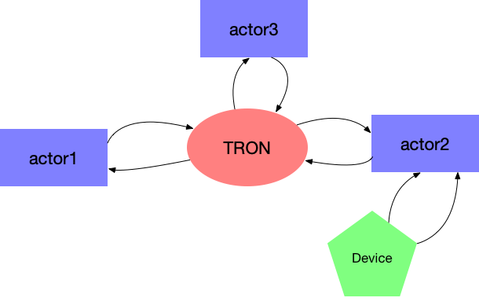

.. _legacy-actors:

Legacy actors
=============

.. _opscore-protocol:

The opscore protocol
--------------------

The `tron <https://github.com/sdss/tron>`_ and `opscore <https://github.com/sdss/opscore>`_ products define a protocol that has been implemented under different frameworks (e.g., `actorcore <https://github.com/sdss/actorcore>`_, `twistedActor <https://github.com/ApachePointObservatory/twistedActor>`_). Very simplistically, the actor structure can be visualised as

As we saw in the :ref:`previous section <new-actors-how>`, actors are both producers of commands and replies, and consumers of them. In the case of legacy/opscore actors, all communication is routed through a central message broker called ``Tron``.

Tron (often called the *hub*) acts as a TCP server (usually on port 6093) to which the actors and clients/commanders can connect to. Similarly, each actor (but not clients) is a TCP server. Tron receives commands through its own socket, parses the header of the command, and then sends it to the appropriate actor through the actor port. The actor executes the command and replies via its port. Tron gets the reply and broadcasts it to *all* the listening actors.

Commands
~~~~~~~~

Commands are sent to Tron as a string over the TCP socket. The format of the command header changes depending on how the Tron decoder has been configured, but for SDSS the format is as follows ::

    program.client message_id target command_string

where ``program.client`` are the program and name of the commander, ``message_id`` is a positive integer assigned by the commander to identify this command and its replies, ``target`` is the actor being commanded, and ``command_string`` is the command to be parsed by the actor. The following is a valid command ::

    OBSERVER.john 17 sop status

When an actor is commanding another actor we normally write the ``program.client`` as ``actor.actor``, for example ::

    sop.sop 5 guider decenter on

Tron receives the message, reformats the header and sends it to the actor as ::

    commander_id message_id command_string

where ``commander_id`` is a number identifying the commander and ``message_id`` is a message ID that does not need to be the same as the commanded ``message_id``.

Replies
~~~~~~~

While processing the command, the actor will usually have to output replies back to the hub. The format of the replies is ::

    user_id message_id message_code reply_data

where:

- Messages are ASCII.
- ``user_id`` is the ID number of the user that sent the command that triggered this reply. Note that this is not the same as the ``commander_id`` from the command, but the internal ID assigned to the connection socket from which the command came. In most cases where there is a single connection to the actor this is irrelevant. Use 0 to broadcast to all connected users.
- ``message_id`` is the ID number of the message that triggered this reply. Use 0 if the reply is unsolicited (i.e. not in response to any command).
- ``message_code`` is a one-character :ref:`message type code <message-codes>`.
- ``reply_data`` is the message data in keyword-value format. Multiple keywords can be output in the same reply as long as they are separated by semi-colons.

For example, if SOP is replying to ``OBSERVER.john 17 sop status`` from Tron, and assuming that Tron is connected to ``sop`` with ``user_id=1``, it could say ::

    1 78 i lamps_on=true; ffs="closed"

Note that the ``message_id=78`` does not match the original ``message_id=17``. This is an internally assigned, unique ``message_id`` that Tron uses to communicate with the actor.

Tron then receives the reply, changes the header to match the original format and then sends it back to *all* the connected users ::

    OBSERVER.john 17 sop i lamps_on=true; ffs="closed"

A note of caution
~~~~~~~~~~~~~~~~~

Tron is very flexible and the protocol defined above is only one of the several that it can implement. Different actors may even have different implementations and Tron can configure each one of them independently. The above is, however, the standard followed by most SDSS actors and the one we recommend. When declaring a new Nub in Tron, the following configuration will produce the desired effect ::

    def start(poller):

        cfg = Misc.cfg.get(g.location, 'actors', doFlush=True)[name]

        stop()

        initCmds = ('ping',
                    'status')

        safeCmdsList = ['info', 'ping', 'version', 'status']
        safeCmds = r'^\s*({0})\s*$'.format('|'.join(safeCmdsList))

        d = ASCIIReplyDecoder(debug=1)
        e = ASCIICmdEncoder(sendCommander=True, useCID=False, debug=1)
        nub = SocketActorNub(poller, cfg['host'], cfg['port'],
                             name=name, encoder=e, decoder=d,
                             grabCID=True, initCmds=initCmds,
                             safeCmds=safeCmds, needsAuth=True,
                             logDir=os.path.join(g.logDir, name),
                             debug=1)
        hub.addActor(nub)

    def stop():
        n = hub.findActor(name)
        if n:
            hub.dropActor(n)
            del n

References
~~~~~~~~~~

- https://www.apo.nmsu.edu/35m_operations/ICCDesign/#Commands (the command header described here is the one used by the APO 3.5-m Tron)
- https://trac.sdss3.org/wiki/Ops/Core [private wiki]

CLU Legacy actor
----------------

CLU provides its own implementation of the above protocol via the `.BaseLegacyActor` class. Although the internals are different, the behaviour for the user should be exactly the same as with the new-style `.AMQPActor` class (e.g., `~.BaseLegacyActor.write` and `~.BaseLegacyActor.send_command` have the same interface). The `.LegacyActor` class provides the actor functionality along with the usual :ref:`Click-based parsing <parser>`.

When the actor is run, it starts a server which is an instance of `.TCPStreamServer`. Optionally, it creates a client connection to Tron that can be accessed over the `~.BaseLegacyActor.tron` attribute. When a new user connects to the server, a callback is issued to `~.BaseLegacyActor.new_user`, which adds the transport to the list of users and outputs some information to the new user. New commands are handled by the `~.BaseLegacyActor.new_command` callback, which parses the command and creates a `.Command` instance which is then sent to `~.BaseActor.parse_command`.

Keyword parsing
~~~~~~~~~~~~~~~

CLU provides tracking of actor models through Tron. The actors for which models need to be tracked must be specified when starting the `actor <.LegacyActor>` with the ``model_names`` list. The models and their values can be accessed via the `actor.models <.TronConnection.models>` parameter.

Internally the parsing of the keywords received from Tron uses the opscore code (opscore does not need to be installed, the code is now part of CLU and migrated to Python 3) and the model must be defined as part of the ``actorkeys`` product.

Although the internals of parsing and validation are significantly different, the `.TronModel` class behaves exactly as `.Model` and the models follows the same structure described in :ref:`keyword-model`.

JSONActor
---------

CLU also provides a simple `.JSONActor` which accepts commands following almost the same format as legacy actors for input commands but replies with a JSON string. This makes the replies more verbose and less human-readable but much more easy to parse, since they can be interpreted by just calling `json.loads` or the equivalent JSON loading routing for any programming language. `.JSONActor` is thus useful for devices that will be commanded by an actor but not directly replying to Tron or a user.

`.JSONActor` is an implementation of `.TCPBaseActor` using a :ref:`Click parser <click-parser>`.
