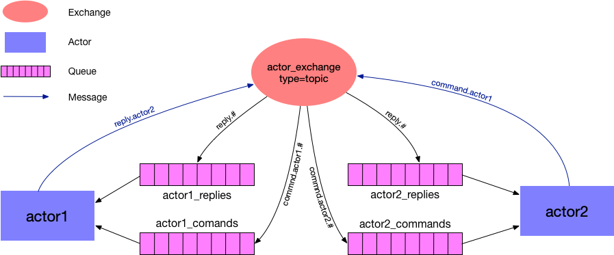

.. role:: underline
    :class: underline

The AMQP actor
==============

The new-style actor that CLU introduces uses the `AMQP <https://www.amqp.org/>`_ protocol, of which `RabbitMQ <https://rabbitmq.com>`_ is the best known implementation, to communicate with other actors and clients. Here we'll delve deeper into how the protocol is implemented and some of the code gritty details.

.. include:: why.rst

How does the new actor work?
----------------------------

To completely understand how the code works you need a basic grasp of the AMQP protocol. The `RabbitMQ tutorial <https://www.rabbitmq.com/getstarted.html>`_ is a good starting point, but let's quickly go over some of the main concepts:

- A program that sends messages is a *producer*. A *message* is any form of communication that can be encoded as bytes, for example a plaintext string or a JSON object.
- A program that receives a message is a *consumer*. :underline:`Actors are both producers and consumers`.
- Messages are sent to *exchanges*. Exchanges can be of different types, which enables various message brokering behaviours.
- A *queue* is a buffer that holds messages. Queues *subscribe* to exchanges to get messages from them.

With all of that in mind, here is a conceptual diagram of how communication happens between two actors:

|

|

This may look daunting so let's break it into smaller pieces:

- We have two actors that are both producers (i.e., can send messages) and consumers (can receive messages). Messages can either be commands or replies.
- There is a global exchange, ``actor_exchange`` used both to send commands and replies. The exchange is of type `topic <https://www.rabbitmq.com/tutorials/tutorial-five-python.html>`_, which  allow queues to subscribe to them and receive only messages that match a certain *routing key*.
- Each actor has a queue for commands and another for replies. The command queue (``<actor>_commands``) only gets messages whose routing key contains the key ``command`` and the name of the actor, and ignores all other command messages. Similarly, the replies queue, ``<actor>_replies``, receives messages that contain the name of the actor. The replies queue also subscribes to messages that have a routing keys ``reply.broadcast``. This enables sending a message to the replies exchange that will be received by all actors.

More actors can be added to this picture, but they all share the same basic components. This enables us to create a slightly modified `RCP <https://www.rabbitmq.com/tutorials/tutorial-six-python.html>`_ pattern in which the callback queue is fixed and we use a topic exchange instead of a direct one.

The protocol
------------

Here we will formalise the AMQP actor protocol. This serves two purposes: document how CLU works internally, and enable other base actor classes to be developed (e.g., a thread-based actor).

Message brokering
~~~~~~~~~~~~~~~~~

We use the `AMQP`_ standard for message queueing. The preferred implementation of the standard is `RabbitMQ`_ but any other broker that complies with the AMQP standard is acceptable.

Communication happens through a single :underline:`topic exchange` called ``actor_exchange``. Actors and clients are both consumers and producers. There is not formal difference between an actor and a client (e.g., a command line interpreter or a GUI) although the latter is not expected to receive commands, only emit them.

Each actor receives messages from two queues:

- The commands queue must be called ``<actor>_commands``, where ``<actor>`` is the name of the actor. It subscribes to the exchange and listens to messages with ``command`` and ``<actor>`` in their routing key. Clients that are not actors do not need to have a commands queue.
- The replies queue is called ``<actor>_replies``. It subscribes to exchange and listens to message with ``reply`` and ``<actor>`` as routing keys. It also listens to messages with the ``reply.broadcast`` routing key.

Queues must be `exclusive <https://www.rabbitmq.com/queues.html#properties>`__ and both exchanges and queues must auto-delete when the connection is closed.

Commands
~~~~~~~~

A command is a message that must conform to the following parameters:

- Its routing key is ``command.<consumer>`` where ``<consumer>`` is the name of the actor that will receive and execute the command. For example, if ``actor1`` is commanding ``actor2``, the routing key would be ``command.actor2``.
- The header of the message must contain two keys: ``commander_id`` set to the name of the actor sending the command, and ``command_id`` set to a unique identifier for the command. `UUID4 <https://docs.python.org/3/library/uuid.html>`_ is recommended for command IDs.
- The ``correlation_id`` of the message must be set to the same value as ``command_id``.
- The content type of the message must be ``text/json``.
- The body of the message must be a JSON string with a simple key called ``command_string`` whose value is the command string to be parsed by the remote actor.

Let's guess that ``actor1`` wants to send the command ``status --verbose`` to ``actor2`` and that we create a unique identifier ``command_id='7b93d8d5-11c1-4c08-82a8-56842e1a86c4'`` for it. The information to be sent is

.. code:: yaml

    {headers: {command_id: '7b93d8d5-11c1-4c08-82a8-56842e1a86c4',
               commander_id: 'actor1'},
     payload: {command_string: 'status --verbose'},
     content-type: 'text/json',
     correlation_id: '7b93d8d5-11c1-4c08-82a8-56842e1a86c4',
     routing_key: 'command.actor2'}

Replies
~~~~~~~

The format for a reply to a command is as follows:

- The routing key must be ``reply.<producer>`` where ``<producer>`` is the actor or client that sent the command we are replying to. If an actor wants to reply with a broadcast to all the actors connected to the exchanged, it may do so with the routing key ``reply.broadcast``.
- The header of the message must contain the keywords ``command_id`` set to the command ID of the command we are replying to, ``commander_id`` set to the name of the commander actor, ``sender`` set to the name of the actor replying, and ``message_code`` with the message type code, which must be one of :ref:`these <message-codes>`. ``commander_id`` and ``command_id`` can be null, if it's the reply is a broadcast.
- The ``correlation_id`` must be the same as the ``command_id`` (`None` for broadcasts).
- The content type of the message must be ``text/json``.
- The body of the message must be a JSON string with a series of keyword-value pairs that conform to the :ref:`keyword model <keyword-model>` of the actor that is replying.

In our example above, we commanded ``actor2` with ``status --verbose``. Let's imagine that the actor run that command and now wants to reply indicating that the lamps are on and the flat field screen is closed. The reply would look like

.. code:: yaml

    {headers: {message_code: ':',
               command_id: '7b93d8d5-11c1-4c08-82a8-56842e1a86c4',
               commander_id: 'actor1',
               sender: 'actor2'},
     payload: {lamps_on: true,
               ffs: 'closed'},
     content-type: 'text/json',
     correlation_id: '7b93d8d5-11c1-4c08-82a8-56842e1a86c4',
     routing_key: 'reply.actor1'}

The internals
-------------

In this section we'll have a quick look at how CLU implements the protocol we just defined. This is probably only useful to know if you are planning to override the `.Actor` class significantly.

For handling the connection to the RabbitMQ server while allowing asynchronous programming we use `aio_pika <https://aio-pika.readthedocs.io>`_, a wrapper around the `Pika <https://pika.readthedocs.io/en/stable/>`_ with support for asyncio.

When an `.Actor` is instantiated and we await `~.Actor.run`, a new instance of `.TopicListener` is created, connects to the RabbitMQ server, and creates a channel and the topic exchange (or connects to it, if it already exists). We then add the ``commands_<actor>`` and ``replies_<actor>`` queues. When a new message is received by the command queue a callback to `~.Actor.new_command` is scheduled. When a new reply is received, we deal with it in `~.Actor.handle_reply` and use it to update the :ref:`internal keyword model <keyword-model>`.

When a new message is received by `~.Actor.new_command` it unpacks the command ID and command string and creates a new instance of `.Command` which is then passed to `~.BaseActor.parse_command`. This method is the one that invokes the click parser with the command string and calls the command function.
